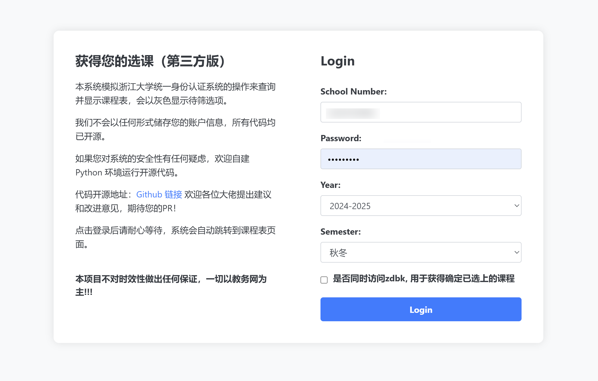
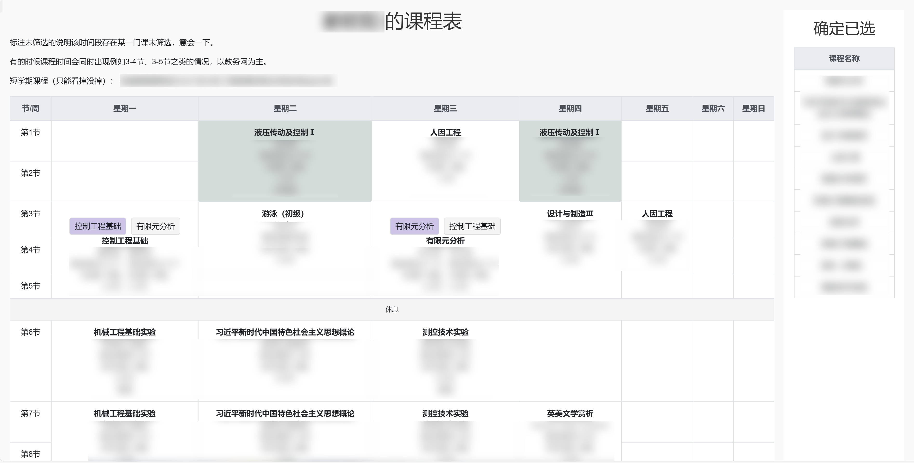
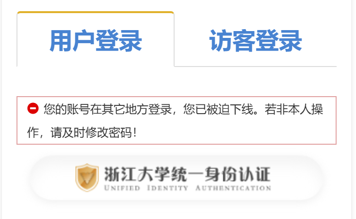

## 《筛了吗？》
本系统模拟浙江大学统一身份认证系统的操作来查询并显示课程表，会以灰色显示待筛选项。

我们不会以任何形式储存您的账户信息，所有代码均已开源。

代码开源地址：<a href="https://github.com/ZJU-R/zjuTimeTable" target="_blank">Github 链接</a> 欢迎各位大佬提出建议和改进意见，期待您的PR！

另外，期待您来点个star ~

点击登录后请耐心等待，系统会自动跳转到课程表页面。

**本项目不对时效性做出任何保证，一切以教务网为主!!!** 

## 登录界面说明

登陆后耐心等待几秒钟；强制要求内网。

## 选课界面说明

- 标注未筛选的说明该时间段存在某一门课未筛选，意会一下。
- 短学期课程只能看掉没掉，不能确定选没选中。
- 当开启“同时访问zdbk后”，还可以看确定已经选中的课程。

## 风险提示

本项目不会以任何形式储存用户名、密码等个人信息或cookie，但是其本质是模拟登录登录，像比如zdbk等网站就会提示您被强迫下线（仅在勾选 同时获取浙大本科 并且您还在其它设备上登录，才会造成此提示）

## 如何运行

1. 安装 `python` 环境（推荐用 `conda` 来管理虚拟环境 , 建议python版本 `3.10`）
2. `cd /安装路径`
3. `pip install -r requirements.txt`
4. `python run_locally.py`
